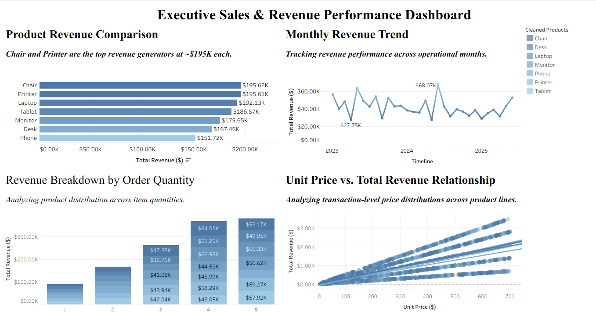

# 📊 Executive Sales & Revenue Performance Dashboard

## 📌 Executive Summary
This project delivers a 4-quadrant executive sales analytics dashboard designed to track key commercial revenue drivers, seasonal trends, product volume distribution, and transaction-level price elasticity. Developed as part of the **DecodeLabs Data Analytics Industrial Kit**.

* **Total Revenue Tracked:** $1.26M+
* **Top Revenue Drivers:** Chair (~$195.62K) & Printer (~$195.61K)
* **Peak Monthly Revenue:** $68.07K

---

## 📄 Executive PDF Report
📁 **[Download Full Executive PDF Report](./Executive_Sales_and_Revenue_Performance_Report.pdf)**

---

## 📊 Dashboard Architecture & Analytics Breakdown

### 1. Product Revenue Comparison (Horizontal Bar Chart)
* **Objective:** Categories ranking by total monetary output.
* **Key Finding:** Chairs ($195.62K) and Printers ($195.61K) lead total sales volume, while Phones represent the lowest revenue segment ($151.72K).

### 2. Monthly Revenue Trend (Line Chart)
* **Objective:** Temporal trends evaluation across 2023–2025 operational periods.
* **Key Finding:** Captures historical seasonality with high peaks ($68.07K) and low troughs ($27.75K), keeping a stable baseline around $40K–$50K/month.

### 3. Revenue Composition by Order Quantity (Stacked Bar Chart)
* **Objective:** Assessing product performance across quantity bins (1 to 5 units).
* **Key Finding:** Higher basket order sizes (4 & 5 units) drive the largest cumulative volume ($350K+ in bin 5).

### 4. Unit Price vs. Total Revenue Relationship (Scatter Plot)
* **Objective:** Transaction-level correlation and elasticity analysis.
* **Mathematical Basis:** $\text{Total Revenue} = \text{Unit Price} \times \text{Quantity}$
* **Key Finding:** Displays 5 distinct linear trendlines corresponding to quantity bins, confirming transparent linear pricing without volume distortions.

---

## 🛠️ Tech Stack & Tools
* **Data Processing & Cleaning:** Python (Pandas), Microsoft Excel
* **SQL Aggregation:** MySQL
* **Business Intelligence & Visualization:** Tableau Public

---

## 🔗 Project Links
* **Interactive Tableau Public Dashboard:** [View Live on Tableau Public](YOUR_TABLEAU_PUBLIC_LINK_HERE)
* **Evaluation Status:** Verified & Completed (DecodeLabs Batch 2026)